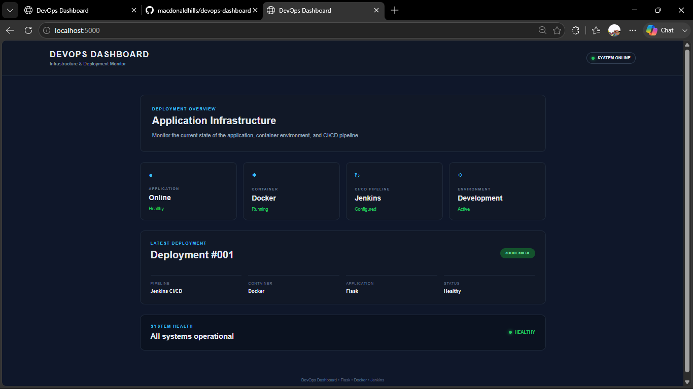
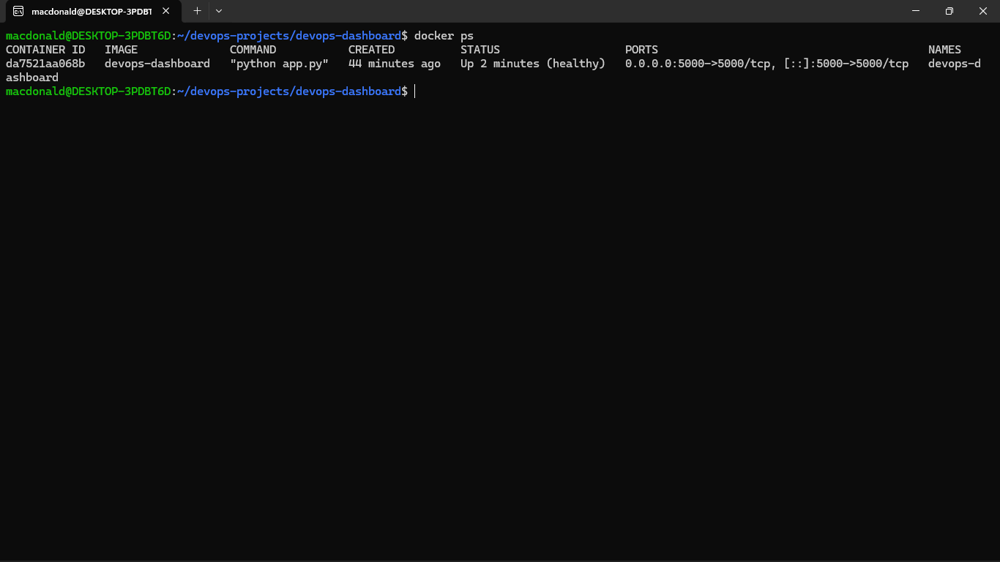

# DevOps Dashboard

A beginner-friendly DevOps dashboard built with Python, Flask, HTML, CSS, and Docker.

The application provides a modern dashboard interface with application health monitoring and is containerized using Docker.

## Features

- Modern DevOps dashboard interface
- Flask web application
- Application health endpoint
- Docker containerization
- Docker health check
- Responsive frontend
- Separate HTML and CSS structure

## Architecture

Browser → Docker Container → Flask Application

## Technologies Used

- Python
- Flask
- HTML
- CSS
- Docker
- Linux (WSL 2)

## Project Structure

devops-dashboard/
│
├── app.py
├── requirements.txt
├── Dockerfile
├── README.md
├── .gitignore
│
├── templates/
│   └── index.html
│
└── static/
    └── style.css

## How to Run

### 1. Build the Docker Image

docker build -t devops-dashboard .

### 2. Start the Container

docker run --name devops-dashboard -p 5000:5000 devops-dashboard

### 3. Access the Dashboard

Open your browser and visit:

http://localhost:5000

### 4. Check Application Health

Open:

http://localhost:5000/health

The endpoint should return:

{
    "status": "healthy",
    "application": "DevOps Dashboard"
}

### 5. Check Docker Health

Run:

docker ps

The container should eventually show:

Up ... (healthy)

## What I Learned

- Building a Flask web application
- Creating a frontend with HTML and CSS
- Creating application health endpoints
- Writing Dockerfiles
- Building Docker images
- Running Docker containers
- Implementing Docker health checks
- Managing projects with Git
- Using Linux and WSL 2
